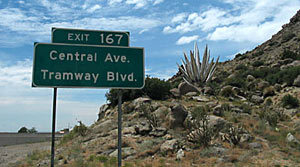
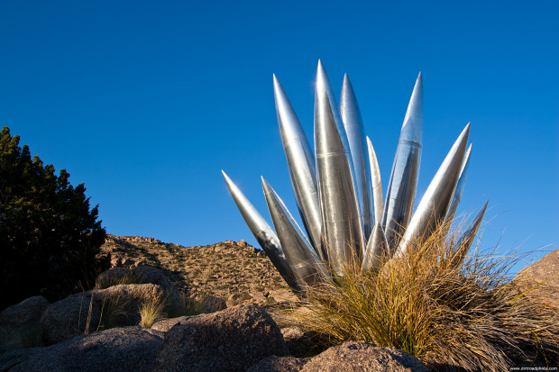
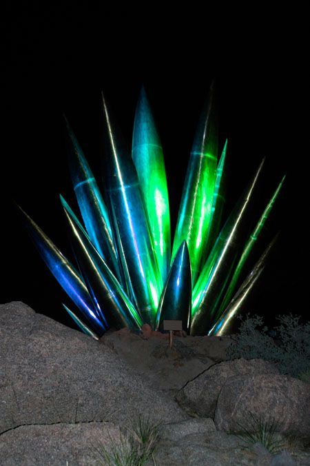

# The Story Behind The Aluminum Yucca

### Introduction

The Aluminum Yucca can be seen day or night as you are entering the East Side of Albuquerque. It can currently be seen on the side of a mountain just sitting there. To get up close to the Yucca, it will require parking your car on the side of the road and a hike. The project itself was meant to serve a greater purpose, but things fell through. As to why it fell through, well nobody is not sure. In the end people can admire it for what its made of, the idea, a get a feel of the history behind it.

### Location & What The Yucca is Made Of

Located on the east end entrance of Albuquerque, there is a tall Alumninum Yucca sitting on an mountain side. It can easily be viewed on I-40 just as you pass the Carneul exit and before the Tramway exit. To visiters it serves as a passage reminding Albuquerque's ties with places like Route 66, Kirkland Air Force Base, and Sandia National Labratories, while serving as a entrance to the East Mountains, and the Estancia Valley. According to an article created by Ron Warnick for the website http://www.route66news.com/2013/05/19/the-story-behind-albuquerques-big-aluminum-yucca/ the structure is about Twenty-Two feet tall Yucca made entirly out of Aluminum. According to the artist's website According to Huethner's website https://www.gordonhuether.com/aluminum-yucca the Yucca itself is made out of recycled tanks from an F-16 fighter jet, and was made to look like a Datil Yucca. To allow the project to be lit up and be seen at night, the yucca is powered by a solar power cell to be lit up by a multitude of different colors.

### The Idea Behind The Yucca

According to an Mountain View Telegraph article written by Mike Bush, published in 2013 on this website https://www.abqjournal.com/200826/aluminum-yucca-greets-i40-drivers.html the project was built around 2003. For a long while this statue was left unexplained to drivers and all who saw it. This was finally answered in 2013 when an artist of the structure explained why this metal Yucca. The artists name is Gordon Huether from southern California. According to the artist's website https://www.gordonhuether.com/aluminum-yucca, the purpose of this project was to celebrate a nostalgia or some sort of a romance for the West, that was located on Route 66 at one time. 

### The History Behind The Yucca

In April of 2003, the Aluminum Yucca was first set up, with the completion occuring in May of that same year. It was meant to be the first of many projects loacted at each of the entrances of Albuquerque. This was the first one that was created because it was possibly the cheapest to make at only $124,000. The price itself wasn't a burden to the Tax payers of Albuquerque however, as it was paid through a grant given by the U.S Department of Transportation. During this planning stage, according to the article in the Mountain View Telegraph, (https://www.abqjournal.com/200826/aluminum-yucca-greets-i40-drivers.html) there were plans to creat a visitor center centered around the history of Route 66. To this day the Yucca is the only part of that project that still exsits.

### What The Yucca Currently Stands As A Reminder For 

Overtime the space around the Aluminum Yucca, has served to travelers going in and out of Albuquerque's East side as a final or beginning into the culture of the city itself. It also shows an idea into what the history is behind the city is. This type of a history existing in a realm located in around the 1950's. It was during this time Albuquerque's ties to Kirkland and Sandia National Labs, were at the strong point. This being New Mexico's part in Nuclear Resaerch, and U.S Airforce bases being used at this time. The second part is the history itslef behind Route 66. It was during the 1960's to 1970's Route 66, traveled through Albuquerque. During this time the road was thriving, and through the location where the Yucca currently is had a hotel and several buissnesses existing. Finally the Yucca is desgined to give off the feel of being in a desert. With it being inspired by a Yucca, and during night its is lit up a green color for the idea the structure itself is a breathing plant.

### Conclusion

In this project, the Yucca serves as a gateway between Albuquerque and the East Mountains along with the Estancia Valley. Made out of recycled fighter jet parts, and being lit up at night, it was the start of a project meant for a larger purpose. Unfortunately, its the only thing that remains from this project. Could it be because the funding falled through, or there was just no public interest in the project itself. Nobody will know. Where it stands now though it serves as a remind to Albuquerque's history with Sandia National Labs, Kirkland Air Force Base, and Route 66, with its retro style. Finally, the space where it shines the artwork does serves its purpose as a gateway between the city itself and the East Mountains.
