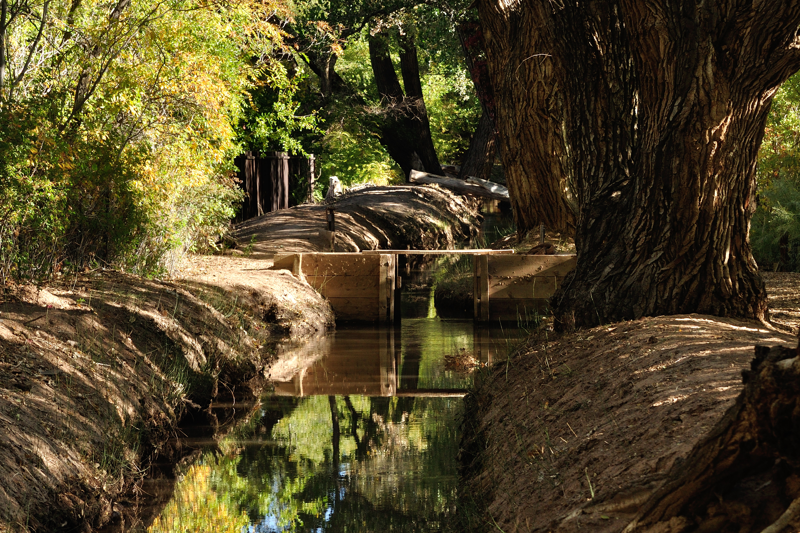
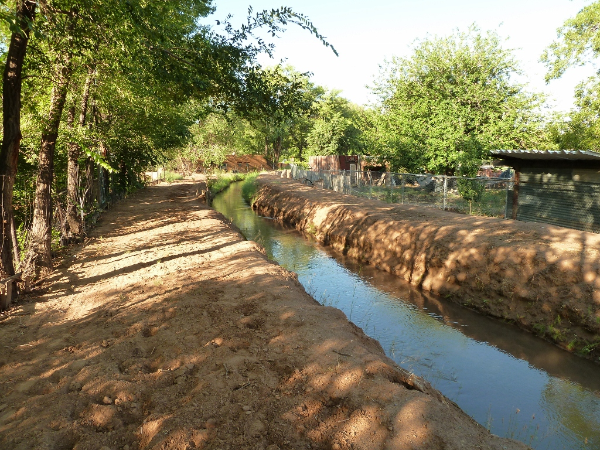
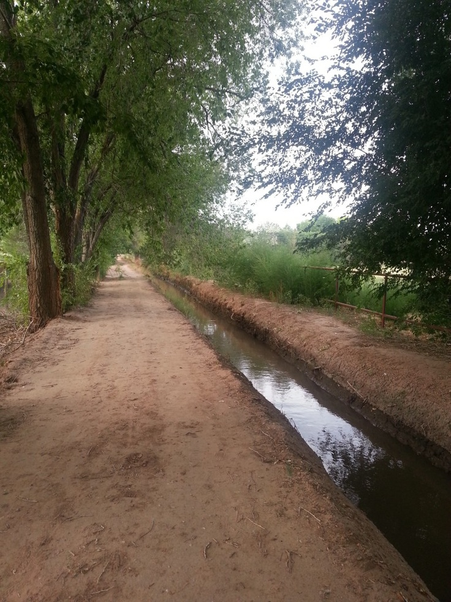

# Acequias: Public Spaces of Tradition and Culture in the South Valley

### What is an Acequia?

Acequias, sometimes referred to as ‘ditches’ or ‘arroyos’ are community-based forms of sharing water used for irrigation, first introduced to the region that is today New Mexico by the Spanish in the seventeenth-century (CESSOS.org). The acequia system itself is much older, dating back to methods developed by the Moors and brought to the Iberian Peninsula during their occupation of the region (ca.700-1492).

### The Valle Atrisco (South Valley)

The Valle Atrisco, commonly referred to the South Valley, is one of the oldest areas of Albuquerque owing its name to the Atrisco Land Grant of 1692 (CESSOS.org). The word "Atrisco" is derived from the Nahuatl word "Atlixo", which means “surface of a body of water (CESSOS.org)" and is an indication of how important acequias and water systems are to the area. The land grant was designed to spur settlement in the area and is still relatively intact to this day as families and individuals whose histories date back centuries still claim rights to land and water in the area (http://dev.newmexicohistory.org/). The acequia system played an integral part in irrigating the land to cultivate corn, wheat, beans, alfalfa, and allowed the area to grow and prosper throughout the seventeenth and eighteenth centuries (http://dev.newmexicohistory.org/). Acequias were the critical point around which farmlands were built and maintained. The space surrounding acequias from the period of the seventeenth century until the end of World War II was essentially rural farmland subdivided between families based on land grants that were centuries old (http://greenfiretimes.com/2015/11/the-genesis-of-acequias-in-atrisco-the-south-valley/).

### The Arenal Acequia

There are five acequias that currently run through the South Valley. They are the Arenal, Armijo, Atrisco, Los Padillas and Pajarito acequias. Despite the space surrounding the acequias of the South Valley changing exponentially over the past four centuries, acequias have managed to remain vital parts of the community, both in practical terms as sources of substinance farming, and as cultural beacons that are honored and preserved. I have chosen the Arenal acequia, specifically the area around the Sanchez Farms Open Space, because of its location in the heart of the South Valley which serves as the best represention of the importance of space to the very existence of the acequias and how the space it occupies within the South Valley plays a unique role in shaping public interactions and notions of the aceuqias themselves. 

What exsists today in the South Valley in terms of its environment is a mix of the rich agricultural lands centered around the acequias which were first established by settlers of the Atrisco Land Grant, and an expanding urban development spurred by the city of Albuquerque and private developers. The expansion of Albuquerque, largely due to factors like modernization and gentrification, has meant that acequias of the Atrisco operate in a semi-urban/semi-rural environment that is unique from most acequias, which tend to be rurally isolated. 

The Arenal acequia runs through the South Valley beginning at the intersection of I-40 and Coors Blvd. running south, diverting at various points, to the border of the city limits and the Isleta Pueblo. The Sanchez Farms Open Space serves as a public area that is centralized in the South Valley, and highlights the hybrid spatial reality of the acequias. The vast open space that sits beside the acequia is a dirt-shrub field within a basin and surrounded by a circular trail. Overlooking the basin, sitting beside the acequia, is a circular terrace area with rocks around its perimeter, effectively serving as chairs. The terrace area and field are designed to promote the use of the space surrounding the acequia for recreational purposes and social gatherings. 

The trail that runs along the acequia south from Sanchez Farms runs though a diverse range of residential neighborhoods and farmlands. Along the trail it is easy to see where the acequia is diverted for agricultural purposes. The diversion of water to homes with farmland are not necessarily isolated from the homes that don't, and serves to highlight the dual urban/rural nature of the acequias. Walking along the acequia it can be easy to forget that you are actually less than one hundred yards from major streets, intersections, and commercial shopping centers. This close proximity to commercial centers and residential neighborhoods has made the acequia popular amongst walkers, runners and bike riders.

### South Valley Acequias Today and into the Future

Today, acequias of the South Valley occupy spaces that serve the dual function of providing an open recreational space for urban non-farmers, while maintaining its distiction as a sacred space that is of vital use to farmers and their land. While increased urbanization of areas around the acequias have made them popular public spaces, it must be kept in mind that this has also led to issues regarding water rights pertaining to usage; i.e. as more people and commercial development move into the area, less water is available for the acequias. These are spatial issues that are currently playing out in the South Valley and will continue into the future as Albuquerque continues to expands.    

http://www.albuqhistsoc.org/SecondSite/pkfiles/pk208landgrants.htm
https://lajicarita.wordpress.com/2014/10/01/say-no-to-zombie-developments/
https://en.wikipedia.org/wiki/Atrisco_Land_Grant
https://en.wikipedia.org/wiki/South_Valley,_New_Mexico
http://dev.newmexicohistory.org/filedetails.php?fileID=24405
http://newmexicohistory.org/people/acequias-the-way-of-the-water
https://www.farmflavor.com/new-mexico/ancient-traditions-keep-water-flowing-in-new-mexico/
http://www.nmacequiacommission.state.nm.us/AcequiaCommission/Publications/kfrancis_harvard_proposal04.pdf
http://newmexicohistory.org/people/iberian-origins-of-new-mexicos-community-acequias
http://www.yesmagazine.org/issues/water-solutions/ancient-traditions-keep-desert-waters-flowing
http://greenfiretimes.com/2015/11/the-genesis-of-acequias-in-atrisco-the-south-valley/
http://rgis.unm.edu/getdata/
