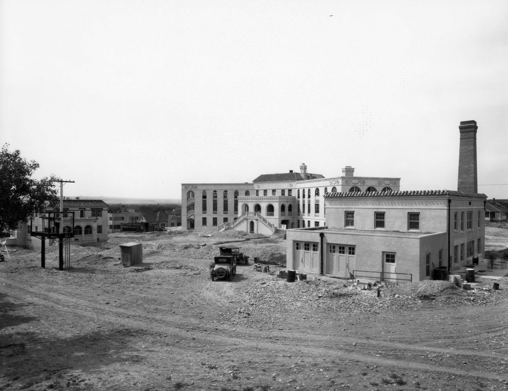
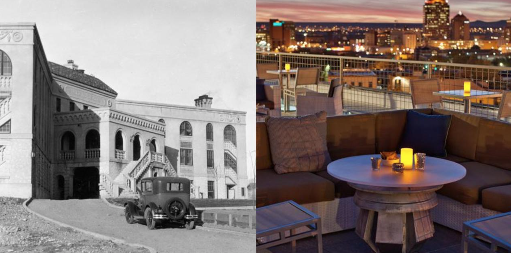
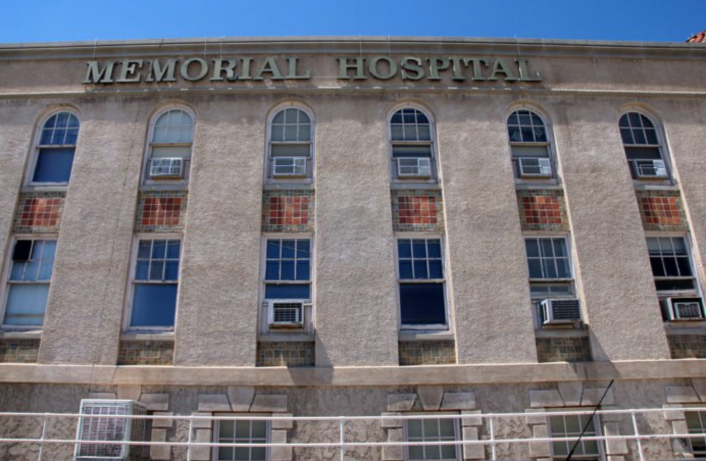
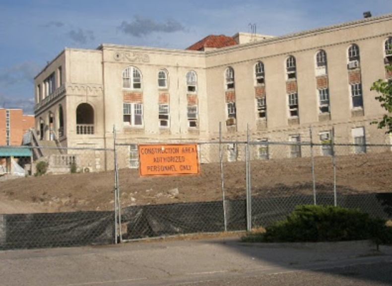

# Parq Central Hotel

The purpose of the Parq Central Hotel is to facilitate economic growth by promoting tourism as well as preserving a piece of history. The Parq Central Hotel (2010-present) remained vacant from 2006-2010 but was formerly a mental institution for children from 1982-2006, called Memorial Hospital, but more importantly the Parq Central Hotel was preserved for its significance in supporting the creation of faster travel to the west coast by providing medical services for railway employees during its time as the Santa Fe Railway hospital from 1926-1982.

## Background

The Santa Fe Railway Hospital was created out of necessity in order to treat injured railway workers, as it was common to lose a finger/hand (seen as the mark of a brakeman) or result in a fatality. Three buildings were created to support this task: the hospital, the physician’s residence, and the boiler building. 

The chosen Italianate architecture style was popular from 1840-1890 reminiscent of the Italian Renaissance; this style was considered elegant, up-scale, and primarily used for designing mansions or public buildings. Recently, renovations to refurbish Memorial Hospital into the Parq Central Hotel consisted of reconditioning and reinstalling the original windows, maintaining the original interior doors (hospital building), utilizing the original buildings, and the addition of modern luxuries.

## What is Space?

Space is more than a geographical representation, mistakenly thought of as only coordinates or latitude longitude. Space is a story that contains history while sharing a dialectical relationship by being static and simultaneously dynamic. Static in the sense that it will always be there, have things built on or around it, used and re-used, and will serve some purpose. And dynamic in the sense that its purpose changes due to intent (i.e. if it no longer serves its purpose then a new one will be found).

The Santa Fe Railway Hospital as well as the Memorial Hospital’s original purpose was to provide medical treatment and then shifted to promoting economic growth in the East downtown district after its hiatus for four years. The purpose affected the cultural memory of this space by influencing people’s perception. In this respect, space is more than a physical place because it directly shapes memory.

## Medical Treatment?

The Santa Fe Railway Hospital as well as the Memorial Hospital served their purpose by redefining the space in which it occupied. A plot of dirt transformed into medical assistance for railway workers and medical treatment for mentally ill children. Beyond this however, the cultural perception and meaning of the space literally began to create a community around it; later supporting another mode of transportation when the freeway and streets were built around it marking its importance.

## Economic Growth?

The Parq Central Hotel did serve its purpose in boosting the economy by using historical memory, modern perspective (renovation), and an exotic appeal to successfully promote tourism. The historical memory allows guests to visit a historical landmark that provided a vital service during railroad construction westward. Modern perspective combined historical memory with a modern touch of comfort to create a pleasing experience. An exotic appeal is the signature brand of the perception of New Mexican culture typically by highlighting local features (e.g. being considered an oasis in the desert).

## References
- http://www.bbc.com/travel/story/20130520-a-hospital-turned-hotel-in-new-mexico 
- http://www.hotelparqcentral.com/press-articles/former-mental-hospital-made-into-hotel-building-was-once-memorial-hospital.htm 
- http://www.nmhistoricpreservation.org/programs/registers.html 
- https://www.nps.gov/nr/national_register_fundamentals.htm 
- https://www.cabq.gov/planning/boards-commissions/landmarks-urban-conservation-commission/historic-landmarks 
- http://www.kansasmemory.org/item/227818
- http://www.downtownacd.org/wp-content/uploads/2013/08/Central-Downtown-History-Architecture-.pdf
- http://abqlibrary.org/railroads
- http://econtent.unm.edu/cdm/ref/collection/abqmuseum/id/939 
- https://en.wikipedia.org/wiki/Atchison,_Topeka_and_Santa_Fe_Railway
- http://www.studioswarch.com/clone-hotel-parq-central 
- http://klingerllc.com/our-projects/commercial/historic-renovations/hotel-parq-central/ 
- http://www.hvlinteriors.com/single_gallery_HPC.html#.WfEJFBOPIlU 
- http://3.bp.blogspot.com/_uM9PrU7_5OY/SmzVNKTUqMI/AAAAAAAAHu8/hiyJ4UdH4Hc/s400/P7242184.JPG 
- https://www.youtube.com/watch?v=dr5uX4Uotzs 
- https://en.wikipedia.org/wiki/Italianate_architecture 
- http://www.phmc.state.pa.us/portal/communities/architecture/styles/late-19th-century-revival.html 
- https://eh.net/encyclopedia/history-of-workplace-safety-in-the-united-states-1880-1970-2/ 
- https://web.stanford.edu/group/spatialhistory/cgi-bin/site/pub.php?id=65 
- http://3.bp.blogspot.com/_uM9PrU7_5OY/SmzVNKTUqMI/AAAAAAAAHu8/hiyJ4UdH4Hc/s400/P7242184.JPG 
- https://media.licdn.com/media/p/2/000/252/2b5/3219196.png 
- http://ichef.bbci.co.uk/wwfeatures/wm/live/1280_640/images/live/p0/19/9d/p0199d7k.jpg 
- http://cdn.onlyinyourstate.com/wp-content/uploads/2016/07/parqcentral1-700x464.jpg 
- http://econtent.unm.edu/cdm/ref/collection/abqmuseum/id/939

