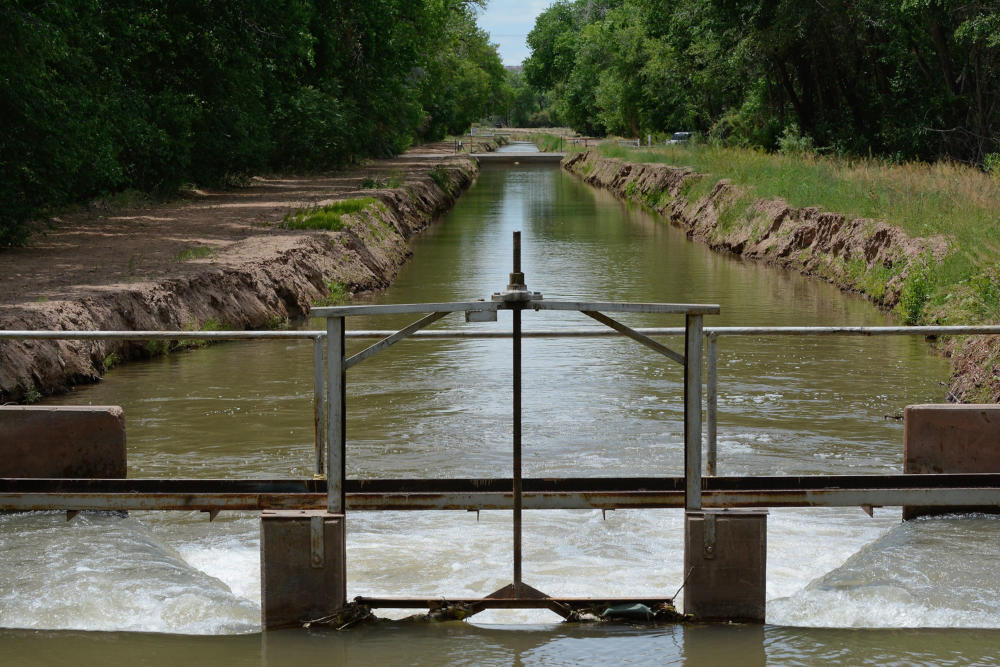



### The Valle Atrisco (South Valley)



The Valle Atrisco, commonly referred to the South Valley, is one of the oldest and most historic areas of Albuquerque, owing its name to the Atrisco Land Grant of 1692.[^source1] The word "Atrisco" is derived from the Nahuatl word "Atlixo", which means “surface of a body of water" and is an indication of how important acequias and water systems are to the area.[^source2] The land grant was designed to spur settlement in the area and is still relatively intact to this day as families and individuals whose histories date back centuries still claim rights to land and water in the area.[^source3] The acequia system played an integral part in irrigating the land to cultivate corn, wheat, beans, alfalfa, and allowed the area to grow and prosper throughout the seventeenth and eighteenth centuries.[^source4] Acequias were the critical point around which farmlands were built and maintained. The space around the acequias from the colonial period of the seventeenth century through World War II consisted of rural farmland subdivided between families.[^source5] Today, due to factors of modernization and urbanization, acequias of the South Valley function as unique sources of public space and cultural tradition.
  
  {% include figure.html class="img-left" width="50%" caption="Acequia Madre irrigation ditch, circa 1890-1910, Neg. No. 055021; courtesy Palace of the Governors Photo Archives NMHM/DCA)" src="images/Acequiamadre.jpeg" %}
  
### What is an Acequia?

Acequias, sometimes referred to as ‘ditches’ or ‘arroyos’ are community-based forms of water sharing used for irrigation, first introduced to the region that is today New Mexico by the Spanish in the seventeenth-century.[^source6] The acequia system itself is much older, dating back to methods developed by the Moors and brought to the Iberian Peninsula during their occupation of the region (ca.700-1492).

{% include figure.html
class="img-right"
width="50%"
caption="Tree lined trail along the acequia"
src="images/acequia1.jpeg"
%}

### The Arenal Acequia

Despite the space surrounding the acequias of the South Valley changing exponentially over the past four centuries, acequias have managed to remain vital parts of the community, both as practical sources of substinance farming, and as cultural beacons that are honored and preserved. There are five acequias that currently run through the South Valley. They are the Arenal, Armijo, Atrisco, Los Padillas and Pajarito acequias.The Arenal acequia, specifically the area around the Sanchez Farms Open Space, is a great example of the dual importance of the acequias. Its location in the heart of the South Valley serves as the best represention of the importance of space to the very existence of the acequias. Additionally, it highlights how the space it occupies within the South Valley plays a unique role in shaping public interactions and notions of the aceuqias themselves.

{% include figure.html class="img-right" width="50%" caption="View of Downtown Albuquerque from the Barelas Neighborhood of the South Valley" src="images/SouthDowntownAlbuquerque.jpeg" %}

What exsists today in the South Valley in terms of its environment is a mix of the rich agricultural lands centered around the acequias, and an expanding urban development spurred by the city of Albuquerque and private developers. The expansion of Albuquerque, largely due to factors like modernization and gentrification, has meant that acequias of the Atrisco operate in a semi-urban/semi-rural environment that is unique from most acequias, which tend to be rurally isolated.

### Why you should visit the Acequias

The [Sanchez Farms Open Space](http://www.bernco.gov/community-services/sanchez-farm-open-space.aspx) serves as a public area that is centralized in the South Valley, and highlights the use of the Arenal acequia as a sacred waterway and recreational space. The vast open space that sits beside the acequia is a dirt-shrub field within a basin and surrounded by trees and a circular trail. Overlooking the basin, sitting beside the acequia, is a circular terrace area with rocks around its perimeter. The terrace area and field are designed to promote the use of the space surrounding the acequia for recreational purposes and social gatherings.



The trail running south along the acequia south from Sanchez Farms passes through a diverse range of old residential neighborhoods and lush farmlands. The trail is lined with trees throughout, which are especially beautiful in the fall months as the leaves become shades of golden yellow and red. Walking along the acequia it can be easy to forget that you are actually less than one hundred yards from major streets, intersections, and commercial shopping centers. This close proximity to commercial centers and residential neighborhoods has made the acequia popular amongst walkers, runners and bike riders.

### South Valley Acequias Today and into the Future

Today, acequias of the South Valley serve the dual function of providing an beautiful recreational space for outdoor enthusiasts, while maintaining its distiction as a sacred space that is of vital use to farmers and their land. While increased urbanization of areas around the acequias have made them popular public spaces, it must be kept in mind that this has also led to issues regarding water rights pertaining to usage; i.e. as more people and commercial development move into the area, less water is available for the acequias. These are spatial issues that are currently playing out in the South Valley and will continue into the future as Albuquerque continues to expands.    

#### Footnotes

[^source1]: Center for Social Sustainable Systems, "[Agua es Sagrada Initiative](https://www.cesoss.org/agua-es-sagrada-initiative)," cesoss.org. [n.d.]
[^source2]: Center for Social Sustainable Systems, "[Agua es Sagrada Initiative](https://www.cesoss.org/agua-es-sagrada-initiative)," cesoss.org. [n.d.]
[^source3]: [JosephVMetzcar](http://dev.newmexicohistory.org/)
[^source4]: [JosephVMetzcar](http://dev.newmexicohistory.org/)
[^source5]: Garcia, Jorge. "[The Genesis of Acequias in Atrisco (South Valley)](http://greenfiretimes.com/2015/11/the-genesis-of-acequias-in-atrisco-the-south-valley/)," Green Fire Times. [n.d.]
[^source6]: Center for Social Sustainable Systems, "[Agua es Sagrada Initiative](https://www.cesoss.org/agua-es-sagrada-initiative)," cesoss.org. [n.d.]

http://www.albuqhistsoc.org/SecondSite/pkfiles/pk208landgrants.htm
https://lajicarita.wordpress.com/2014/10/01/say-no-to-zombie-developments/
https://en.wikipedia.org/wiki/Atrisco_Land_Grant
https://en.wikipedia.org/wiki/South_Valley,_New_Mexico
http://dev.newmexicohistory.org/filedetails.php?fileID=24405
http://newmexicohistory.org/people/acequias-the-way-of-the-water
https://www.farmflavor.com/new-mexico/ancient-traditions-keep-water-flowing-in-new-mexico/
http://www.nmacequiacommission.state.nm.us/AcequiaCommission/Publications/kfrancis_harvard_proposal04.pdf
http://newmexicohistory.org/people/iberian-origins-of-new-mexicos-community-acequias
http://www.yesmagazine.org/issues/water-solutions/ancient-traditions-keep-desert-waters-flowing
http://greenfiretimes.com/2015/11/the-genesis-of-acequias-in-atrisco-the-south-valley/
http://rgis.unm.edu/getdata/
