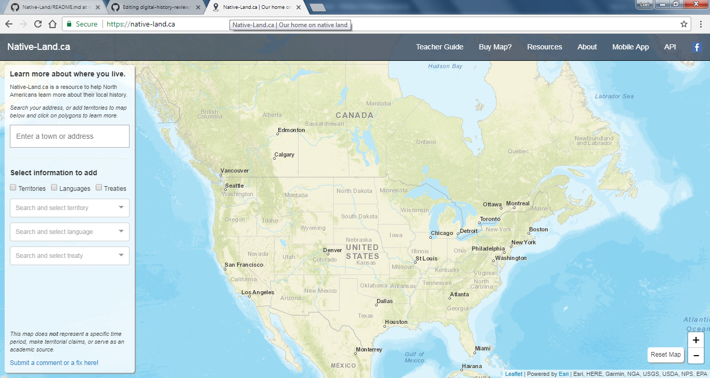
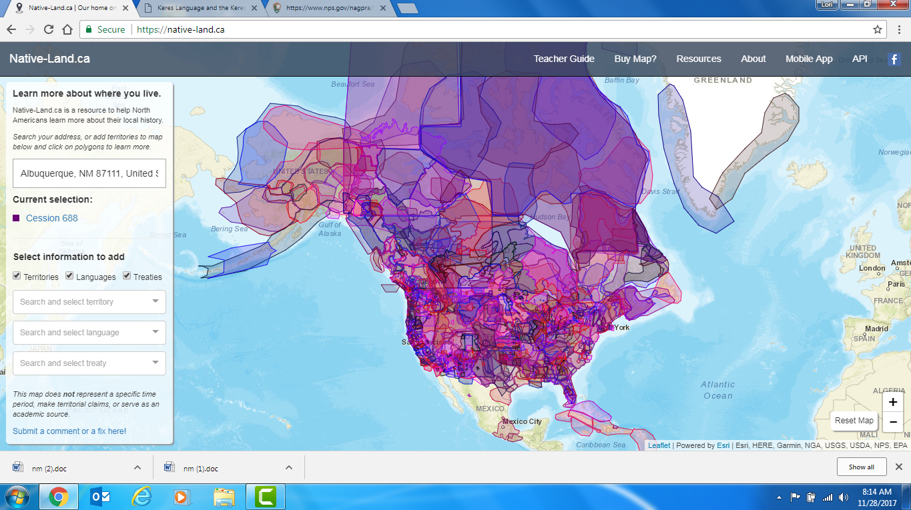

# Mapping Project Critique- [Native-Land.CA ](https://native-land.ca/)

Lorilei Chavez
 
Native Land, according to the founder Temperanova, is 'a [web app](https://github.com/tempranova/Native-Land/blob/master/README.md) with Google Maps API for mapping Indigenous territories, languages, and treaties across Turtle Island (North America).'

 
 
 ### Overview
 
The main functionality of the web app is to allow for user to enter a town or address to find out what Indigenous territories, languages, and treaties exist in current day North America. The goal of the web app is to simply meant to sit on top of Google maps and provide a map of native land. The audience that this website is geared toward is North Americans interested in learning more about their local history. Furthermore, it could be inferred that this website could be used as an educational resource for both High school and post-secondary classes.

The main selections of the mapping web app are: the 'territories' option, the 'languages' option, and the 'treaties' option. 

In the 'Territories' option, users are able to view territories of Indigenous nations. Users are then able to select a certain area which will lead to a website from the tribe or the Wikipedia page of the tribe where the territory is located.
  

The same goes for the 'language' selection on the web app which also allows users to view languages of Indigenous people that exist in the North American hemisphere. Selecting a specific area's language will link users to *[Native-Land.org](http://www.native-languages.org/)* which is a third party website that specializes in Native languages.

  
 
 Lastly, the treaty selection displays many treaties that have affected Indigenous lands and people across North America. Also, in accordance with other selection features, it allows users to view treaties that have involved current lands and connects them to the *[National Park Service U.S Department of the Interior](https://www.nps.gov/nagpra/ONLINEDB/Land_Cessions/INDEX.HTM)'s* website which gives further information on Indian Land cessions. 
 
 
 ### Data

The data that is correlated to develop map web app is displayed on the [Resources](https://native-land.ca/resources.html) page of the site and displays links to the many different resources used to provide information on territories, languages, and treaties

 
 
 
 under construction 
 
 ### Critique
 
 The design of this website is
 

 
 under construction 
 
 ### Final Thoughts
 
 under construction 
 

 
